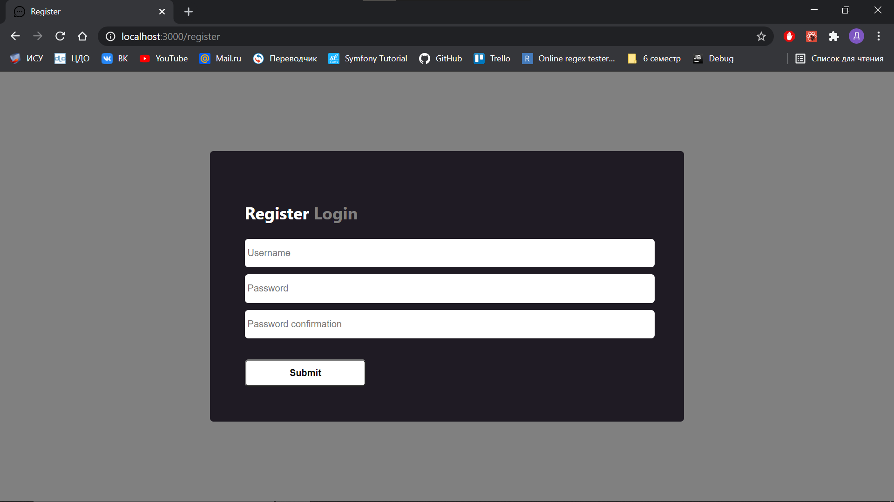
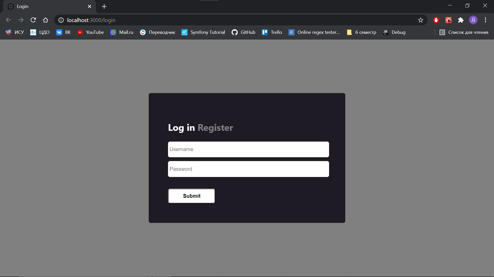
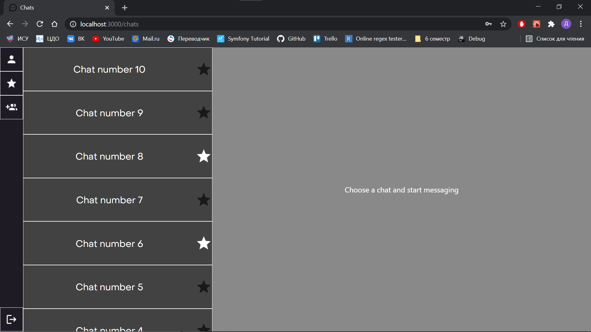
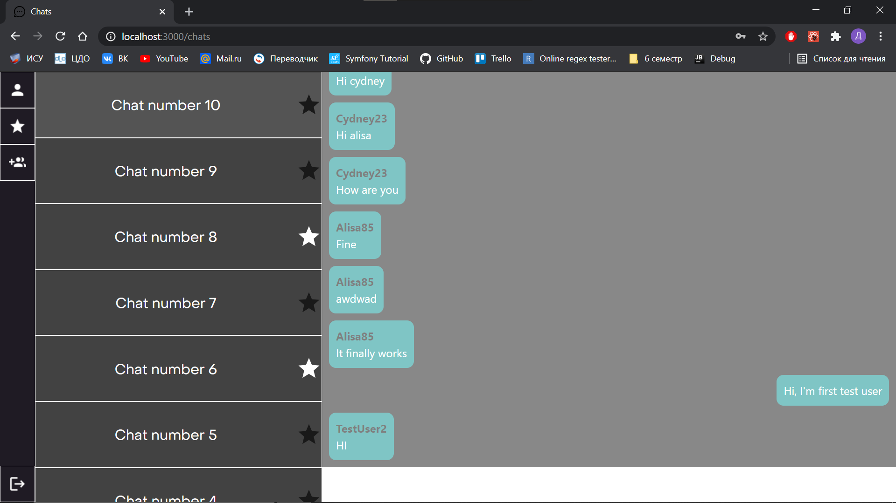
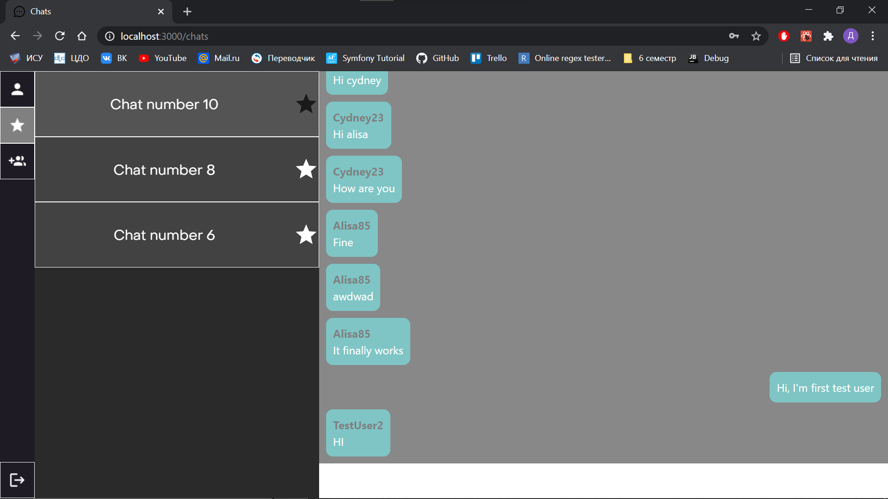

# Group Messenger

Group Messenger is a web application that provides:

* Chatting in groups
* Protected authentication
* Saving favorite chats

## Written

* Node.js
* React.js

Using Next.js

## Installation

```bash
git clone https://github.com/denchech/group-messenger.git
npm install
```

Run server in dev mode
```bash
npm run dev
```

Or in production mode
```bash
npm run start
```

## Usage

### Register


### Log in


### Front page


### Chat


### Favorite


